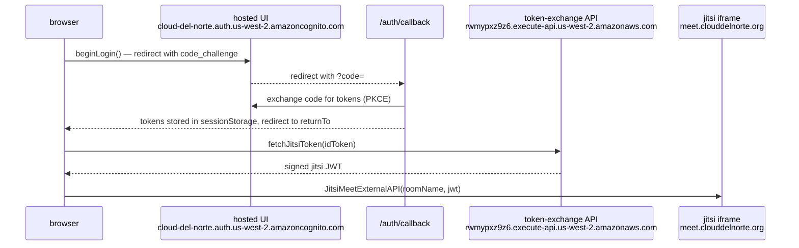

# AWS User Group Cloud Del Norte — Website

Community website for the **AWS User Group Cloud Del Norte** (formerly awsaerospace), serving the North Coast region.

🌐 **Live:** <https://d2ly3jmh1f74xt.cloudfront.net>
📅 **Meetup:** <https://www.meetup.com/cloud-del-norte/>

---

## milestone — first verified call: 2026-04-23

- first end-to-end video call confirmed: sign-in → JWT exchange → jitsi room join with live video/audio
- first-user bootstrap complete — one moderator exists, room creation is live
- full auth chain live: Cognito Hosted UI → `/auth/callback/` → token exchange → jitsi iframe embed
- operational detail, asset inventory, spin-up/down playbooks: `BryanChasko/jitsi-video-hosting-ops` `OPERATIONS.md`

---

## Stack

| Layer | Technology |
| ----- | ---------- |
| Bundler | Vite 7 (multi-page app) |
| UI | React 19 + [Cloudscape Design System](https://cloudscape.design/) 3.x |
| Language | TypeScript 5.9 |
| Tests | Vitest + @testing-library/react |
| Linter | ESLint 10 (flat config — `eslint.config.js`) |
| Build output | `./lib/` |
| Hosting | S3 + CloudFront |

---

## Getting Started

```bash
npm install              # install dependencies
npm run dev              # dev server at localhost:8080
npm run build            # tsc + vite build → ./lib/
npm run lint             # eslint
npm test                 # vitest run
npm run test:watch       # vitest (watch mode)
npm run test:ui          # vitest --ui
npm run coverage         # vitest run --coverage
```

Quality gate before deploy: `npm run lint && npm test && npm run build`

---

## Architecture

This is a **multi-page app (MPA)** — each page is an independent Vite entry point. There is no React Router and no shared runtime bundle between pages.

### Page anatomy

Every page requires exactly three files:

```
src/pages/<name>/
  index.html    ← Vite HTML entry point
  main.tsx      ← mounts React root, imports global styles + tokens
  app.tsx       ← page component tree wrapped in Shell
```

### Pages

| Page | Path |
| ---- | ---- |
| Home | `src/pages/home/` |
| Meetings | `src/pages/meetings/` |
| Create Meeting | `src/pages/create-meeting/` |
| Learning / API | `src/pages/learning/api/` |
| Maintenance Calendar | `src/pages/maintenance-calendar/` |
| Theme Preview | `src/pages/theme/` |

### Adding a new page

1. Create `src/pages/<name>/` with `index.html`, `main.tsx`, and `app.tsx`
2. Register the entry in `vite.config.ts` → `build.rollupOptions.input`
3. Add a nav item in `src/components/navigation/index.tsx`

### Page Compliance Checklist

Every page must implement **all** of the following:

- [ ] **Shell wrapper** — `app.tsx` wraps content in `<Shell>` from `src/layouts/shell`
- [ ] **Theme state** — `useState<Theme>` initialized via `initializeTheme()`, passed to Shell
- [ ] **Locale state** — `useState<Locale>` initialized via `initializeLocale()`, passed to Shell inside `<LocaleProvider>`
- [ ] **Deep imports** — all Cloudscape components imported via deep paths (e.g. `@cloudscape-design/components/button`)
- [ ] **`t()` translation** — all user-visible strings use `t('namespace.key')` from `useTranslation()`, never hardcoded English
- [ ] **`document.title`** — set via `t()` so it updates on locale change
- [ ] **`data.ts` locale-aware** — if the page has a `data.ts` file, metric labels / descriptions use translation keys (not raw strings)

### Page boilerplate — `app.tsx`

```tsx
import { useState } from 'react';
import { LocaleProvider } from '../../contexts/locale-context';
import Shell from '../../layouts/shell';
import Navigation from '../../components/navigation';
import Breadcrumbs from '../../components/breadcrumbs';
import { initializeTheme, applyTheme, setStoredTheme, type Theme } from '../../utils/theme';
import { initializeLocale, applyLocale, setStoredLocale, type Locale } from '../../utils/locale';

export default function App() {
  const [theme, setTheme] = useState<Theme>(() => initializeTheme());
  const [locale, setLocale] = useState<Locale>(() => initializeLocale());

  const handleThemeChange = (newTheme: Theme) => {
    setTheme(newTheme);
    applyTheme(newTheme);
    setStoredTheme(newTheme);
  };
  const handleLocaleChange = (newLocale: Locale) => {
    setLocale(newLocale);
    applyLocale(newLocale);
    setStoredLocale(newLocale);
  };

  return (
    <LocaleProvider locale={locale}>
      <Shell
        theme={theme}
        onThemeChange={handleThemeChange}
        locale={locale}
        onLocaleChange={handleLocaleChange}
        breadcrumbs={<Breadcrumbs active={{ text: 'Page Title', href: '/<name>/index.html' }} />}
        navigation={<Navigation />}
      >
        {/* page content */}
      </Shell>
    </LocaleProvider>
  );
}
```

### `data.ts` → `t()` pattern for locale-aware static data

If a page has static data (e.g. metric labels, descriptions, topic names), those strings must be kept as translation keys and resolved at render time — **not** hardcoded as English strings:

```ts
// ❌ Wrong — hardcodes English, bypasses locale
export const metrics = [{ label: 'Active Members', value: 42 }];

// ✅ Correct — return keys, resolve with t() at render time
export const METRIC_KEYS = [{ labelKey: 'home.metrics.activeMembers', value: 42 }];

// In the component:
const { t } = useTranslation();
metrics.map(m => ({ ...m, label: t(m.labelKey) }))
```

### Key conventions

- **Deep imports only** — `import Button from '@cloudscape-design/components/button'` (never barrel imports)
- **No path aliases** — all imports use relative paths
- **Cloudscape only** — no other UI component libraries
- **No backend** — static site; data fetched at build time and bundled as JSON

See [AGENTS.md](AGENTS.md) for the full architectural conventions and constraints.

---

## Localization

The site supports two locales, toggled via 🇺🇸↔🇲🇽 in the top navigation:

| Locale | Flag | Description |
| ------ | ---- | ----------- |
| `us` | 🇺🇸 | New Mexican English — El Paso Spanglish + local slang |
| `mx` | 🇲🇽 | Chihuahua norteño Spanish — Ciudad Juárez dialect |

Translation files live in `src/locales/`:
- `en-US.json` — English (source of truth)
- `es-MX.json` — Spanish (human-reviewed translations)

Components use the `useTranslation()` hook:

```tsx
import { useTranslation } from '../../hooks/useTranslation';

export default function MyComponent() {
  const { t } = useTranslation();
  return <Header>{t('namespace.headerTitle')}</Header>;
}
```

See [LOCALIZATION.md](LOCALIZATION.md) for dialect guides, key naming conventions, and translation workflow.

---

## Deploy

### CI/CD (GitHub Actions)

`.github/workflows/deploy.yml` triggers on pushes to `main` that touch `src/`,
`public/`, `package.json`, `package-lock.json`, `vite.config.ts`, or `tsconfig.json`.

It runs: `npm install` → `npm run build` → `aws s3 sync` → CloudFront invalidation.

**Required repo secrets** (Settings → Secrets and variables → Actions):

| Secret | Purpose |
| ------ | ------- |
| `AWS_ACCESS_KEY_ID` | IAM access key |
| `AWS_SECRET_ACCESS_KEY` | IAM secret key |
| `AWS_ROLE_ARN` | IAM role ARN for OIDC (optional if using keys) |

> ⚠️ If secrets are not configured, the workflow builds successfully but
> **silently skips** the S3 deploy and CloudFront invalidation.

### Manual deploy

```bash
aws sso login --profile aerospaceug-admin
npm run lint && npm test && npm run build
aws s3 sync lib/ s3://awsaerospace.org --delete --profile aerospaceug-admin
aws cloudfront create-invalidation \
  --distribution-id ECC3LP1BL2CZS \
  --paths "/*" \
  --profile aerospaceug-admin
```

| Resource | Value |
| -------- | ----- |
| AWS CLI profile | `aerospaceug-admin` (SSO) |
| S3 bucket | `awsaerospace.org` |
| CloudFront distribution | `ECC3LP1BL2CZS` |
| CloudFront domain | `d2ly3jmh1f74xt.cloudfront.net` |

---

## Authentication

the site uses a zero-dependency OIDC PKCE flow against **Cognito Hosted UI** — no third-party auth library

### flow summary



tokens live in **sessionStorage** — tab-scoped, cleared on tab close. no localStorage, no cookies

### page gates

| page | gate |
| ---- | ---- |
| /meetings | `<RequireAuth>` — any authenticated user |
| /create-meeting | `<RequireAuth requireGroup="moderator">` — moderator-only |
| all other pages | public |

unauthenticated visitors are redirected to Hosted UI; `returnTo` encodes the original pathname so they land back after sign-in. moderator group mismatch renders a Cloudscape Alert with a sign-out option instead of the page content

### jitsi embed flow

1. user lands on /meetings, authenticated
2. `jitsi-embed.tsx` calls `fetchJitsiToken()` from `src/lib/jitsi-token.ts`
3. `jitsi-token.ts` posts the Cognito `idToken` to the token-exchange API; on 401 it silently refreshes tokens and retries once; on 403 it throws `BannedUserError`
4. the returned signed JWT is passed to `JitsiMeetExternalAPI` from `https://meet.clouddelnorte.org/external_api.js` (lazy-loaded)
5. jitsi domain: `meet.clouddelnorte.org` — 4-container ECS stack, JWT-gated. see [`chasko-labs/jitsi-video-hosting`](https://github.com/chasko-labs/jitsi-video-hosting) for the runtime

### how it works — file layout

| file | role |
| ---- | ---- |
| `src/lib/auth.ts` | OIDC PKCE core: `beginLogin`, `handleCallback`, `getIdToken`, `getAccessToken`, `refreshTokens`, `signOut`, `decodeToken` |
| `src/lib/jitsi-token.ts` | fetches jitsi JWT from token-exchange API; module-scoped cache; handles 401 retry + typed `BannedUserError` |
| `src/contexts/auth-context.tsx` | `AuthProvider` — silent-refresh timer at 80% token lifetime; storage event listener for cross-tab sign-out |
| `src/hooks/useAuth.ts` | `useAuth()` — consumes AuthContext |
| `src/components/require-auth/index.tsx` | wraps pages; calls `beginLogin` for unauthed, renders Alert for group mismatches |
| `src/pages/auth/callback/` | MPA entry (`index.html` + `main.tsx` + `app.tsx`); handles `?code=` param, redirects to `returnTo` or renders error Alert |
| `src/pages/meetings/components/jitsi-embed.tsx` | iframe embed component |
| `src/pages/meetings/components/meetings-table.tsx` | Join column + Cloudscape Modal that mounts the embed |

the `Shell` layout (`src/layouts/shell/index.tsx`) is wrapped with `AuthProvider` at the top level. TopNavigation gains sign-in/sign-out UI: a menu-dropdown when authenticated (with "moderator" description for moderators), a button when not

### cognito identifiers

| resource | value |
| -------- | ----- |
| user pool | `us-west-2_cyPQF4F3r` |
| SPA app client | `57eikmt418ea6vti2f6h0pl74r` |
| hosted UI domain | `cloud-del-norte.auth.us-west-2.amazoncognito.com` |
| token-exchange API | `https://rwmypxz9z6.execute-api.us-west-2.amazonaws.com/token/jitsi` |

Cognito user pool + Lambda token-exchange infra lives in [`chasko-labs/cloud-del-norte-meet`](https://github.com/chasko-labs/cloud-del-norte-meet) (CDK)

### how to maintain

**rotate jitsi JWT secret**
the token-exchange Lambda reads the JWT signing secret from AWS Secrets Manager in account `170473530355` (jitsi account). to rotate: update the secret value in Secrets Manager, then redeploy or force a Lambda cold start. no code changes needed in this repo

**adjust CSP / security headers**
response headers policy is managed out-of-band via CloudFront. the policy definition lives in `infra/cloudfront-security-headers.json`. to apply changes:
```bash
AWS_PROFILE=aerospaceug-admin ./infra/apply-security-headers.sh
```
see `infra/README.md` for the current policy state. changes take effect after CloudFront propagation (~60s), no invalidation required

**deploy workflow**
`.github/workflows/deploy.yml` triggers on pushes to `main` that touch `src/`, `public/`, or config files. the workflow builds, syncs to S3, then issues a CloudFront invalidation against distribution `ECC3LP1BL2CZS`. OIDC-federated role (`AWS_ROLE_ARN` secret) is used if present; the deploy step sets `continue-on-error: true` so a missing role won't fail the build check

### how to remove

removing the auth layer is reversible — no DB migrations, no external state owned by this repo:

1. in `src/pages/meetings/app.tsx` — unwrap `<RequireAuth>` from the page component
2. in `src/pages/create-meeting/app.tsx` — same
3. in `src/layouts/shell/index.tsx` — remove the `<AuthProvider>` wrapper
4. delete `src/lib/auth.ts`, `src/lib/jitsi-token.ts`, `src/contexts/auth-context.tsx`, `src/hooks/useAuth.ts`, `src/components/require-auth/`, `src/pages/auth/`
5. delete `src/pages/meetings/components/jitsi-embed.tsx`; revert `meetings-table.tsx` to drop the Join column
6. remove the auth callback entry from `vite.config.ts` → `build.rollupOptions.input`

the Cognito pool, Lambda, and jitsi runtime are unaffected — they live in separate repos and accounts

---

## AI Agent Team

This project uses [Squad](https://github.com/bradygaster/squad) v0.5.4 with [HeraldStack](https://github.com/BryanChasko/HeraldStack) personas for AI-assisted development. Run `copilot --agent squad` to engage the team. See [AGENTS.md](AGENTS.md) for agent roles and routing.

---

## Security

See [CONTRIBUTING.md](CONTRIBUTING.md) for more information.

## License

The sample code is available under a modified MIT license. See the [LICENSE](LICENSE) file.
